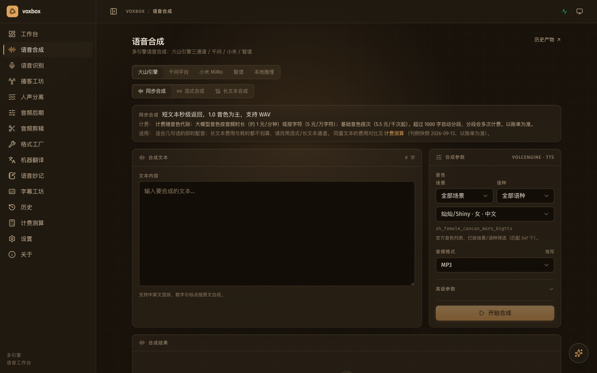
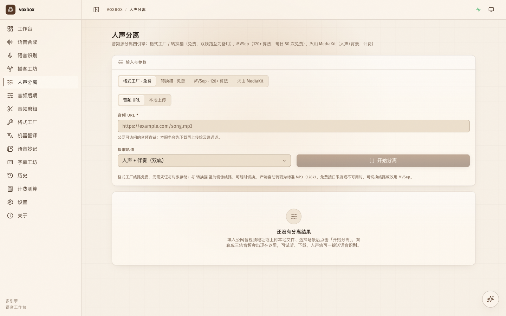
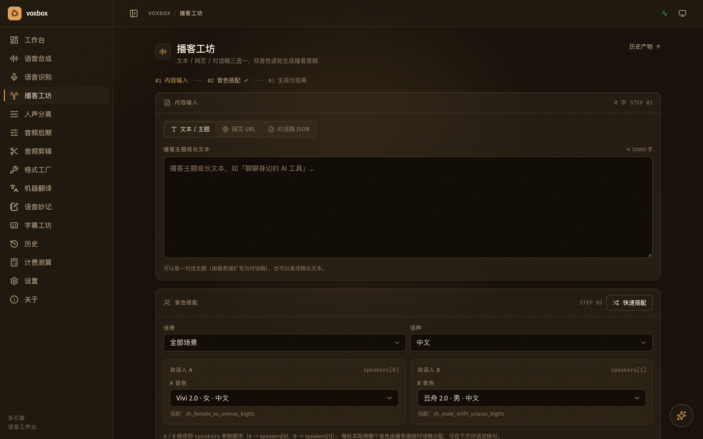
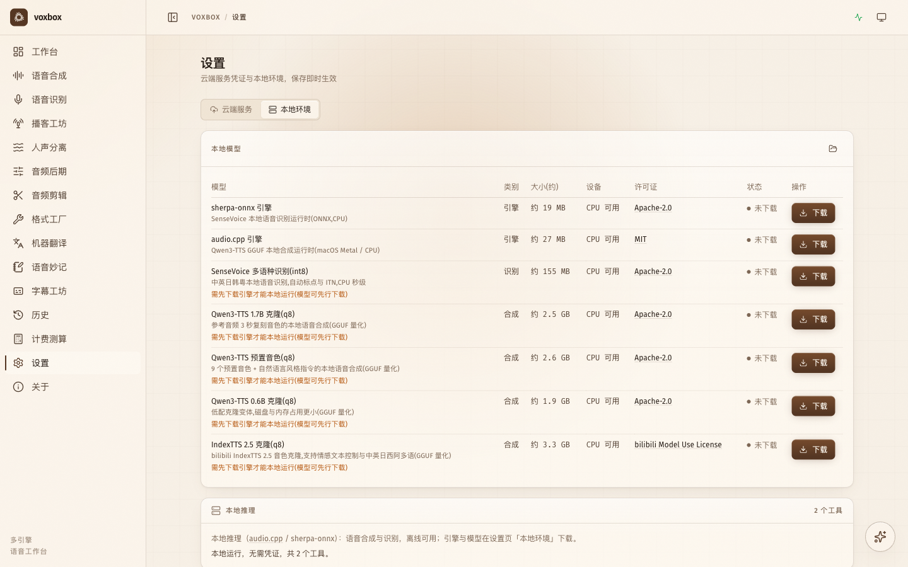
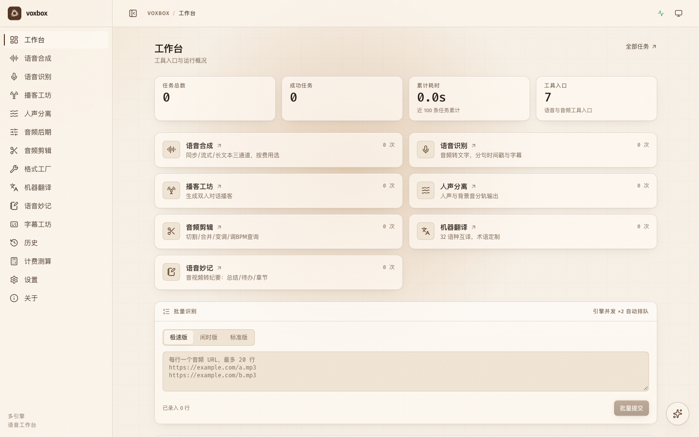
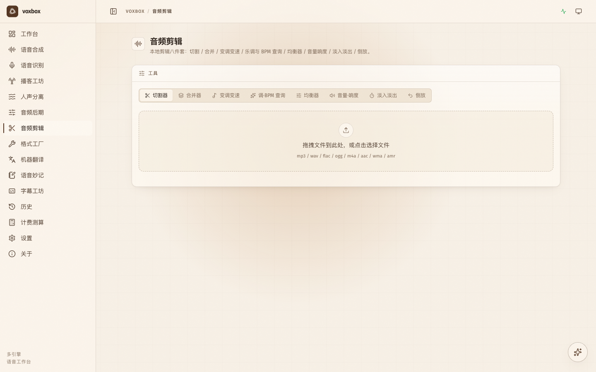

<p align="center">
  
</p>

<h1 align="center">VoxBox</h1>

<p align="center">装进本机的语音 AI 工作台：配音、转写、播客、人声分离、音频剪辑、翻译——一个应用全办妥，云端引擎与本地推理兼备。</p>

<p align="center">
  <a href="https://github.com/yann0917/voxbox/releases"></a>
  <a href="https://github.com/yann0917/voxbox/blob/main/LICENSE"></a>
  <a href="https://deepwiki.com/yann0917/voxbox"></a>
</p>

---

## 界面一览

**语音合成**：六套引擎（火山 / 千问 / 小米 / 智谱 / OpenRouter / 本地推理）一台切换，同步、流式、长文本三通道。



**人声分离**：格式工厂 / 转换猫（免费）、MVSep（120+ 算法）、火山 MediaKit 四引擎可选。



<table>
  <tr>
    <td width="50%"></td>
    <td width="50%"></td>
  </tr>
  <tr>
    <td align="center">播客工坊：一句话主题，双音色逐轮生成</td>
    <td align="center">本地环境：引擎与模型一键下载，离线可用</td>
  </tr>
  <tr>
    <td width="50%"></td>
    <td width="50%"></td>
  </tr>
  <tr>
    <td align="center">工作台：工具入口与运行概况</td>
    <td align="center">音频剪辑：切割合并变调，本机完成</td>
  </tr>
</table>

## 能做什么

<table>
  <tr><th width="120">功能</th><th>说明</th></tr>
  <tr><td>语音合成</td><td>文本转语音：同步秒级 / 流式低延迟（20 语种 8 方言）/ 长文本 10 万字，可出 SRT 字幕，支持情感与风格指令</td></tr>
  <tr><td>语音识别</td><td>音频转文字：本地文件或 URL，分句时间戳、SRT 字幕；极速版秒级返回，闲时版更省钱</td></tr>
  <tr><td>播客工坊</td><td>一句话主题、长文本、网页或对话稿，双音色逐轮生成双人播客</td></tr>
  <tr><td>人声分离</td><td>人声 / 伴奏 / 鼓 / 贝斯等分轨输出：免费通道开箱即用，MVSep 120+ 算法，MediaKit 人声背景双轨</td></tr>
  <tr><td>音频剪辑</td><td>切割、合并、变调变速、乐调与 BPM 查询、均衡器、音量响度、淡入淡出、倒放，全部本机完成</td></tr>
  <tr><td>音频后期</td><td>混音台（垫音 / 低切 / 音量包络）、自动切高潮、口播闪避</td></tr>
  <tr><td>格式工厂</td><td>视频 / 音频 / 图片在线转换与压缩，免费</td></tr>
  <tr><td>机器翻译</td><td>32 语种互译、自动检测源语言、术语定制</td></tr>
  <tr><td>语音妙记</td><td>音视频转结构化纪要：全文总结、待办提取、章节速览</td></tr>
  <tr><td>字幕工坊</td><td>分句时间戳转 SRT / ASS 样式字幕，卡拉 OK 逐字渲染</td></tr>
  <tr><td>计费测算</td><td>各引擎刊例价同量对比，用前先算账</td></tr>
  <tr><td>AI 助手</td><td>全站悬浮对话窗，直接复用已配置的 API Key</td></tr>
</table>

## 快速开始

### 桌面应用（推荐）

从 [Releases](https://github.com/yann0917/voxbox/releases) 下载最新的 `desktop-v*` 版本：

| 平台 | 文件 |
|---|---|
| macOS（Apple Silicon） | `VoxBox_*_aarch64.dmg` |
| macOS（Intel） | `VoxBox_*_x64.dmg` |
| Windows | `VoxBox_*_x64-setup.exe` |

安装打开即用，无需注册登录。剪辑、音色库、克隆合成等依赖的 FFmpeg 已内置，开箱即用。

> **Windows 首次运行**：SmartScreen 弹窗点「更多信息」→「仍要运行」。

打开后在 **设置 → 云端服务** 填入各家 API Key 即可使用对应云端能力；不配任何凭证，也能用格式工厂免费通道和本地推理（设置 → 本地环境 下载引擎与模型后离线使用）。应用启动时自动检查更新，确认后一键升级。

### Web 控制台（自托管）

从 [Releases](https://github.com/yann0917/voxbox/releases) 下载 `v*` 版本对应平台的 zip，解压即得单个可执行文件：

```bash
./voxbox serve --port 8081
# 浏览器打开 http://127.0.0.1:8081
```

凭证在 Web 设置页填写，与桌面版完全一致。也可以从源码构建：`make all` 产出 `bin/voxbox`。

### 命令行

同一个可执行文件也是 CLI，适合脚本与自动化（加 `--json` 输出机器可读结果）：

```bash
voxbox tts "你好，voxbox" --out hello.mp3            # 文本转语音
voxbox asr meeting.mp3 --out transcript.txt          # 音频转文字
voxbox podcast "聊聊本地大模型" --speakers <音色A>,<音色B> --out podcast.mp3
voxbox separate song.mp3 --engine gsgc --stems both  # 人声伴奏分离（免费通道）
voxbox translate "你好，世界" --to en --out en.txt    # 机器翻译
```

完整命令与参数见 [CLI 完整参考](skills/voxbox/references/cli.md)，或 `voxbox <命令> --help`。

### 让 AI Agent 接入

```bash
voxbox skill install   # 把能力说明装进本机 agent（Claude Code / WorkBuddy / CodeBuddy）
voxbox mcp             # stdio MCP server，Claude Code 等 MCP 客户端可直连
```

MCP 接入配置见 [docs/mcp.md](docs/mcp.md)。

## 云端凭证

| 平台 | 需要什么 | 覆盖能力 |
|---|---|---|
| 火山引擎 | APP ID + Access Token，或新版 API Key | 合成 / 识别 / 播客 / 翻译 / 妙记 |
| 火山 AI MediaKit | MediaKit API Key（独立） | 人声背景分离 |
| 千问 / 小米 / 智谱 | 各一个 API Key | 合成与识别备选引擎 |
| OpenRouter | 一个 API Key（[openrouter.ai](https://openrouter.ai/settings/keys) 创建） | Gemini TTS 合成备选引擎 |
| MVSep | API Token（[mvsep.com](https://mvsep.com) 注册获取） | 120+ 分离算法 |
| 格式工厂 / 转换猫 | 无需凭证 | 免费分离与格式转换 |
| 本地推理 | 无需凭证 | 离线合成与识别 |

凭证、任务与产物都保存在本机数据目录，不上传、不同步；只有你主动使用的云端能力才会把内容发给对应服务商。

## 给开发者

```bash
make all     # 构建前端 + 编译单二进制到 bin/voxbox
make test    # Go 测试全量
make dist    # 交叉编译五个平台打包到 dist/
```

单二进制：前端产物 `go:embed` 内嵌，SQLite 存状态，零外部依赖，可交叉编译。技术栈：Go（gin / gorm / cobra）· React 19 + TypeScript + Vite + Tailwind CSS v4 · Tauri 2（桌面壳）。

- [UI 设计规范](design-system/voxbox/MASTER.md)：色彩 / 字体 / 间距 / 组件规格
- [MCP Server](docs/mcp.md)：`voxbox mcp` 接入配置与工具清单
- [JSON 输出契约](docs/json-contract.md)：`--json` / MCP 输出的字段与稳定性承诺
- 桌面版发布走 GitHub Actions（`.github/workflows/desktop-release.yml`），本地构建 `make desktop`

## Star History

<a href="https://www.star-history.com/?repos=yann0917%2Fvoxbox&type=date&legend=bottom-right">
 <picture>
   <source media="(prefers-color-scheme: dark)" srcset="https://api.star-history.com/chart?repos=yann0917/voxbox&type=date&theme=dark&legend=top-left" />
   <source media="(prefers-color-scheme: light)" srcset="https://api.star-history.com/chart?repos=yann0917/voxbox&type=date&legend=top-left" />
   
 </picture>
</a>

## License

[MIT](LICENSE).
